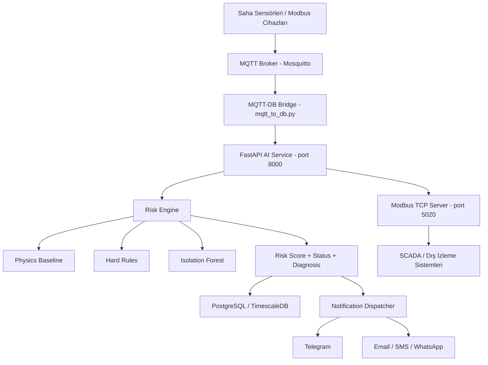

# Grid Up - Panel/Cell Anomaly Early Warning

Grid Up, elektrik panelleri ve hücrelerde oluşabilecek ısınma, gevşek bağlantı, aşırı yük, kondensasyon, sensör arızası ve benzeri durumları erken aşamada tespit eden, on-premise çalışan bir anomali izleme ve erken uyarı sistemidir. Proje, saha verilerini toplayıp bir hibrit risk motoru ile değerlendiren, ardından kritik durumlarda operatörlere uyarı gönderen bir mimariye sahiptir.

Amaç, arızanın kritik seviyeye gelmeden önce müdahale edilebilmesini sağlamaktır. Bu yaklaşım hem bakım maliyetlerini azaltır hem de çevrim dışı/aksayan ekipmanların sebep olduğu üretim kesintilerini önler.

---

## 1. Proje Nedir?

Bu sistem, elektrik panellerinde ve dağıtım hücrelerinde kullanılan sensör verilerini izler ve şu sorulara cevap verir:

- Normal çalışma koşulları içinde mi kalınıyor?
- Isı artışı ve akım yükü uyumlu mu?
- Gevşek bağlantı, yüklü çalışma, nem/yoğuşma veya sensör sorunu gibi bir risk sinyali var mı?
- Durum kritik seviyeye gelmeden önce uyarı üretmek mümkün mü?

Sistem, sadece bir ML modeliyle çalışmaz; fizik tabanlı termal modeller, kesin kural kontrolleri ve izinsiz davranış tespiti (novelty detection) birlikte kullanılır. Böylece karar mekanizması hem yorumlanabilir hem de güvenilir hale gelir.

---

## 2. Temel Özellikler

- Gerçek zamanlı saha verisi izleme
- Modüler per-panel/çift hat bazlı risk analizi
- Fizik tabanlı ısınma ve yük analizi
- Hard-rule tabanlı kritik durum kontrolü
- Isolation Forest tabanlı anomali tespiti
- Noisy-OR füzyon mantığı ile birleşik risk skoru
- SCADA/Modbus entegrasyonu için hazır mimari
- MQTT tabanlı asenkron veri akışı
- Telegram, e-posta ve diğer bildirim kanalları için uyarlanabilir alarm sistemi
- Bulut bağımlılığı olmayan on-premise çalışma modeli
- Yeniden üretilebilir eğitim ve değerlendirme akışı

---

## 3. Mimari Genel Bakış



### Ana bileşenler

1. Saha ve donanım katmanı
   - Modbus tabanlı sensörler ve enerji ölçüm cihazları
   - Akım, sıcaklık, nem, TVOC-2 gibi parametreler
   - Panellerdeki kritik koşulların sinyal olarak yakalanması

2. Haberleşme katmanı
   - MQTT broker üzerinden asenkron veri akışı
   - `mqtt_to_db.py` aracılığıyla AI hizmetine veri aktarımı
   - Modbus TCP sunucusu ile SCADA entegrasyonu

3. Uygulama katmanı
   - `main.py` ile uygulama servislerinin başlatılması
   - FastAPI tabanlı AI inference servisleri
   - RiskEngine ve feature pipeline

4. Veri ve depolama katmanı
   - PostgreSQL / TimescaleDB üzerinde veri saklama
   - Zaman serisi verileri ve alarm geçmişi

5. Bildirim katmanı
   - Kritik risk durumlarında Telegram, e-posta, SMS/WhatsApp gibi kanallar üzerinden uyarı

---

## 4. AI Risk Motoru

AI bileşeni, tek başına birkaç sensörden oluşan ham veriyi alır ve aşağıdaki çıktıyı üretir:

- risk_score (0-100)
- status (NORMAL / WATCH / WARNING / CRITICAL gibi)
- suspected_condition
- explanation / reasons
- confidence
- health score

Risk motoru, gelen veriyi aşağıdaki sırayla işler:

```text
reading
  -> schema validation
  -> feature extraction
  -> baseline / rule / model evaluation
  -> evidence aggregation
  -> noisy-OR fusion
  -> status + diagnosis + recommended action
```

### 4.1 Hard Rules

Bazı durumlar model tahminine ihtiyaç duymaz. Aşağıdaki olaylar doğrudan risk olarak değerlendirilir:

- ark trip / ark tespiti
- aşırı sıcaklık
- aşırı yük
- yoğuşma/kondensasyon
- sensör arızası
- kritik elektriksel anomali

Bu kural tabanlı mantık, modelin hata yapma olasılığına karşı güvenli bir taban oluşturur.

### 4.2 Fizik Tabanlı Baseline

Her modül için uygun bir termal referans modeli kurulur. Temel fikir şudur:

- yük akımı arttığında ısı üretimi artar
- kabin sıcaklığı ve bağlantı sıcaklığı arasındaki fark önemli bir göstergedir
- beklenenden fazla ısı üretimi, gevşek bağlantı veya termal zayıflık işareti olabilir

Bu yaklaşım, yalnızca veri eğitimiyle türetilen bir modelden daha güvenilir ve yorumlanabilir sonuçlar üretir.

### 4.3 Makine Öğrenmesi

Isolation Forest kullanılarak olası anomali davranışlar tespit edilir. Ancak ML sinyali, tek başına kritik sonuç üretmez; maksimum etkisi kontrol edilerek sistemi aşırı alarm vermekten korur.

Bu tasarım önemli bir prensibi yansıtır:

- kesin kurallar ve fiziksel baselines önceliklidir
- ML, ek kanıt olarak katkı sunar
- model tek başına "kritik" sonuç üretmez

### 4.4 Risk Füzyonu

Farklı sinyaller birleştirilirken noisy-OR yaklaşımı kullanılır. Bu yöntem, birbirinden bağımsız kanallardaki risk sinyallerini tek bir skora dönüştürür. Sonrasında şartlı teşhisler ve reason setleri üretilir.

---

## 5. Veri Akışı

Sistem, sahadaki ham veriyi alıp kritik durumları yöneten bir akış hattı oluşturur.

1. Sensörler ve modbus cihazları, sıcaklık, akım, nem ve ark durumunu toplar.
2. Veriler MQTT üzerinde yayınlanır.
3. `mqtt_to_db.py` bu veriyi dinler ve AI servisine iletir.
4. FastAPI uygulaması `/ingest` uç noktasına gelen veriyi işleyerek risk analizini yapar.
5. Sonuç veritabanına kaydedilir.
6. Risk seviyesi belirlenen eşiklere ulaştığında bildirimin gönderilmesi tetiklenir.

Bu akış, sistemin asenkron ve ölçeklenebilir olmasını sağlar.

---

## 6. Uç Noktalar ve Entegrasyonlar

### FastAPI AI servisi

Uygulama, AI risk motorunu HTTP üzerinden servis eder. Temel işlevler arasında şunlar yer alır:

- `/health` : sistem durumu ve sağlık bilgisi
- `/ingest` : tekil sensör okuma ile risk analizi
- replay ve scenario destekleri
- modül bazlı geçmiş tampon yönetimi

### Modbus TCP sunucusu

SCADA/izleme sistemleriyle entegrasyon için kullanılabilecek bir Modbus TCP sunucusu bulunur. Bu sayede dış sistemler panel durumunu ve bazı risk bilgilerini okuyabilir.

### MQTT

Saha cihazlarından gelen verilerin broker üzerinden paylaşımı için Mosquitto kullanılır. Bu yapı, gecikmeyi düşük tutar ve sistemin farklı modüllerine aynı veri akışını aynı anda sağlayabilir.

### Bildirim kanalları

Operatörler, risk durumunda aşağıdaki kanallardan bilgilendirilir:

- Telegram bot
- E-posta
- SMS / WhatsApp
- Dahili alarm akışı

---

## 7. Proje Yapısı

```text
.
├── docker-compose.yml
├── pyproject.toml
├── README.md
├── SKILLS.md
├── docs/
│   ├── ai_evaluation_summary.md
│   ├── algorithm_and_software_structure.md
│   ├── end_to_end_data_flow.md
│   ├── modbus_register_mapping.md
│   └── system_architecture.md
├── mosquitto/
│   └── config/
│       └── mosquitto.conf
├── src/
│   └── grid_up_anomaly_detection/
│       ├── __init__.py
│       ├── config.py
│       ├── main.py
│       ├── modbus_server.py
│       ├── models.py
│       ├── mqtt_to_db.py
│       ├── simulate_mqtt.py
│       ├── ai/
│       │   ├── baseline.py
│       │   ├── config.py
│       │   ├── engine.py
│       │   ├── evaluation.py
│       │   ├── features.py
│       │   ├── loaders.py
│       │   ├── ml.py
│       │   ├── modbus_maps.py
│       │   ├── observability.py
│       │   ├── physics.py
│       │   ├── reasons.py
│       │   ├── risk.py
│       │   ├── schema.py
│       │   ├── simulator.py
│       │   ├── configs/
│       │   ├── docs/
│       │   ├── scripts/
│       │   └── service/
│       └── communication/
│           ├── base_notifier.py
│           ├── dispatcher.py
│           ├── email/
│           ├── sms/
│           ├── telegram/
│           └── whatsapp/
├── tests/
│   ├── test_notifications.py
│   ├── test_pipeline.py
│   ├── test_service.py
│   └── test_telegram_bot.py
└── .gitignore
```

### Önemli klasörler

- `src/grid_up_anomaly_detection/ai/` : risk analizi, ML, fiziksel referans, özellik çıkarımı, değerlendirme kodları
- `src/grid_up_anomaly_detection/communication/` : e-posta, SMS, WhatsApp, Telegram bildirimleri
- `src/grid_up_anomaly_detection/ai/scripts/` : veri üretimi, eğitim, değerlendirme, replay ve ölçek testleri
- `docs/` : mimari, veri akışı, SCADA haritaları ve tasarım belgeleri

---

## 8. Geliştirme Ortamı ve Kurulum

### Gereksinimler

- Python 3.11+
- Poetry
- Docker / Docker Compose
- MQTT broker
- PostgreSQL veya TimescaleDB

### Kurulum

```bash
poetry install --all-extras
```

`api` seçeneğiyle FastAPI destekli yürütme sağlanır. Geliştirme için gerekli bağımlılıklar `pyproject.toml` içinde tanımlanmıştır.

### Testler

```bash
poetry run pytest -q
poetry run ruff check .
```

---

## 9. Çalıştırma Yöntemleri

### 9.1 Altyapı başlatma

Veritabanı ve MQTT broker'ını arka planda başlatır:

```bash
docker-compose up -d
```

### 9.2 Ana sistemin başlatılması

```bash
poetry run python src/grid_up_anomaly_detection/main.py
```

Bu komut aşağıdaki bileşenleri başlatır:

- FastAPI servis (port 8000)
- Modbus TCP server (port 5020)
- Telegram listener (arka plan)

### 9.3 MQTT bridge

Saha verilerini dinleyip AI servisine iletir:

```bash
poetry run python src/grid_up_anomaly_detection/mqtt_to_db.py
```

### 9.4 Veri simülasyonu

Test amaçlı örnek anomali verisi üretir:

```bash
poetry run python src/grid_up_anomaly_detection/simulate_mqtt.py
```

---

## 10. Yapay Zeka ve Eğitim Akışı

Aşağıdaki senaryolar, değiştirilebilir ve yeniden üretilebilir bir veri ve model akışı sunar:

```bash
poetry run python src/grid_up_anomaly_detection/ai/scripts/generate_synthetic.py
poetry run python src/grid_up_anomaly_detection/ai/scripts/train.py
poetry run python src/grid_up_anomaly_detection/ai/scripts/evaluate.py
poetry run python src/grid_up_anomaly_detection/ai/scripts/diagnose_run.py loose_connection
poetry run python src/grid_up_anomaly_detection/ai/scripts/scale_test.py --modules 100
```

Bu akış şunları sağlar:

- sentetik senaryo verisi üretimi
- modül bazlı termal baselines eğitimi
- Isolation Forest modeli eğitimi
- değerlendirme raporları
- risk neden analizi
- ölçek testi ve performans kontrolü

---

## 11. Bu Proje Neden Özel?

Bu proje, yalnızca anomali tespiti yapan bir sistem değil; izlenen ekipmanın davranışını açıklayan, yorumlanabilir ve operasyonel karar destek sağlayan bir erken uyarı platformudur.

Öne çıkan değerler:

- endüstri ve enerji altyapısına uygun mimari
- güvenilir, açıklanabilir risk çıktıları
- on-premise çalışabilme yeteneği
- Modbus + MQTT + REST entegrasyonları
- operasyonel alarm ve müdahale desteği

Bu sayede sistem, yalın bir demo değil; saha operasyonları için kullanılabilir bir risk yönetim ve izleme çözümü olarak düşünülmelidir.

---

## 12. Kullanım Notları ve Pratik Gereklilikler

- Uç sistemler için doğru sensör kalibrasyonu ve zaman senkronizasyonu kritiktir.
- Baseline modeller, gerçek saha verisi ile yenilenmeli ve doğrulanmalıdır.
- Alarm eşikleri, operasyonel kritikliğe göre ayarlanabilir.
- MQTT ve DB servisleri, üretim ortamında izlenmeli ve loglanmalıdır.
- Telegram botu ve e-posta kanalları, güvenlik ve yetkilendirme politikalarına göre konfigüre edilmelidir.

---

## 13. Geliştirici Notları

Projede geliştirici ve tasarım notları, mimari açıklamalar ve detaylı teknik belgelere `docs/` klasörü altında ulaşılabilir. Özellikle bu belgeler şunları içerir:

- sistem mimarisi
- veri akışı
- SCADA register haritaları
- AI değerlendirme çıktıları
- algoritma ve yazılım yapısı

Daha fazla bilgi için [docs/system_architecture.md](docs/system_architecture.md), [docs/end_to_end_data_flow.md](docs/end_to_end_data_flow.md), [docs/algorithm_and_software_structure.md](docs/algorithm_and_software_structure.md) belgelerini inceleyebilirsiniz.

---

## 14. Kısa Özet

Grid Up, dağıtım panelleri ve hücreler için geliştirilen hibrit, açıklanabilir ve işletmeye uygun bir erken uyarı sistemidir. Sensör verilerini toplayıp, fiziksel ve ML tabanlı sinyalleri birleştirerek risk üretir; ardından operasyonel ve teknik ekipleri gecikmeden bilgilendirir.

Bu proje, yalnızca bir "makine öğrenmesi demosu" değil, endüstriyel izleme ve bakım önleme hedefi taşıyan gerçek bir operasyonel altyapı fikrinin uygulanmış halidir.
