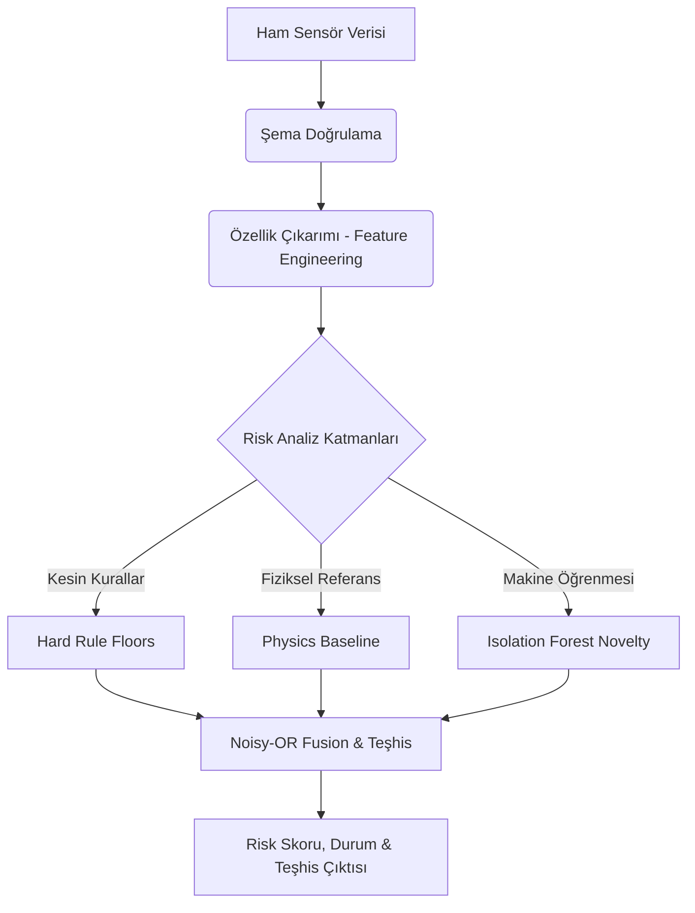

# Grid Up: Yazılım ve Algoritma Yapısı

Bu döküman, Grid Up Anomaly Detection projesinin temel yazılım mimarisini ve karar/analiz mekanizmalarını sağlayan yapay zeka (AI) algoritmalarını detaylandırmaktadır. Proje, donanımsal arızaları kritik seviyeye gelmeden tespit eden hibrit bir risk motoru üzerine kuruludur.

## 1. Yazılım Bileşenleri Organizasyonu

Projenin çekirdek yapısı modüler bir Python mimarisi (Poetry tabanlı) ile geliştirilmiştir ve `src/grid_up_anomaly_detection/` dizini altında organize edilmiştir:

*   **`ai/` (Yapay Zeka ve Risk Motoru):** Sistemin beynidir. İçerisinde özellik mühendisliği (`features.py`), ML modelleri (`ml.py`), fizik tabanlı referans modelleri (`baseline.py`), teşhis ve füzyon mantığı (`risk.py` ve `engine.py`) bulunur.
*   **`communication/` (İletişim ve Uyarılar):** Telegram, SMS, WhatsApp ve Email gibi kanallar üzerinden alarm (dispatcher) yönetimini sağlar.
*   **`mqtt_to_db.py` & `main.py`:** Servislerin ayağa kaldırılması, API uç noktalarının (FastAPI) sunulması ve asenkron veri tüketimi süreçlerini yönetir.

## 2. AI Risk Motoru (Risk Engine) Algoritması

AI Risk Engine, salt bir "Kara Kutu" Makine Öğrenmesi (ML) modeli **değildir**. Fizik tabanlı analizler, kesin kural setleri (hard rules) ve anomali tespiti (ML) yöntemlerinin birleştirildiği **Hibrit** bir yapıdadır. Temel akış şu şekildedir:

### 2.1. Değerlendirme Katmanları

1.  **Kesin Kurallar (Hard Rules):**
    Modelin veya makine öğrenmesinin sonucunu beklemeden doğrudan risk skoru üreten statik eşiklerdir. Örneğin:
    *   Ark Tespiti (Arc Trip)
    *   Mutlak Aşırı Sıcaklık (Absolute Temperature Limit)
    *   Termal Aşırı Yükleme (Overload)
    *   Yoğuşma (Condensation) ve Sensör Hataları.
    *   *Kural mantığı:* Bir "Ark Tespiti", bir ML tahmini değil, mutlak bir eylem gerektiren kesin bir olaydır.

2.  **Fizik Tabanlı Temel Çizgi (Physics Baseline):**
    Her bir pano modülü için devreye alma (commissioning) sırasında kalibre edilen termodinamik denklemlerdir. 
    *   **Ana Denklem:** `T_lug − T_cabinet ≈ a·LPF_τ((I/Ir)²·R_cu(T)) + b`
    *   Açıklama: Sistemin mevcut yük akımı (`I`), kabin sıcaklığı ve nominal akımına göre üretmesi gereken "beklenen" ısı hesaplanır. Eğer modül olması gerekenden daha fazla ısınıyorsa (Load-normalized heating index), ML modeli olmasa dahi Gevşek Bağlantı (Loose Connection) gibi bir soruna işaret eder. Faz asimetrisi de burada hesaplanır.

3.  **Makine Öğrenmesi (Isolation Forest):**
    Beklenmeyen durumları (Novelty Detection) yakalamak için `scikit-learn` Isolation Forest kullanılır. 
    *   *Güvenlik Kısıtı:* ML modeli tek başına (fiziksel veya kesin kural kanıtı olmadan) durumu en fazla "WATCH" (İzleme) seviyesine çıkarabilir. Model ağırlıkları sınırlandırılmıştır.

### 2.2. Veri Füzyonu ve Teşhis (Noisy-OR & Signature Table)

Tüm katmanlardan elde edilen bulgular, bağımsız olasılıkların birleştirilmesi için kullanılan **Noisy-OR** mantığıyla bir risk skoruna (0-100) dönüştürülür (`risk_fused`). 

Bir arıza durumu sezinlendiğinde (Örn: Gevşek Bağlantı - Loose Connection), hata teşhisi bir İmza Tablosu (Signature Table) yardımıyla konularak "Şüpheli Durum" (Suspected Condition) ve "Önerilen Aksiyon" belirlenir. Sistem aynı zamanda geçmiş okumaları tamponlayarak (buffer) zamansal trend analizleri ve "Kritik Duruma Kalan Süre" (Time to Critical) tahmini yapar.

