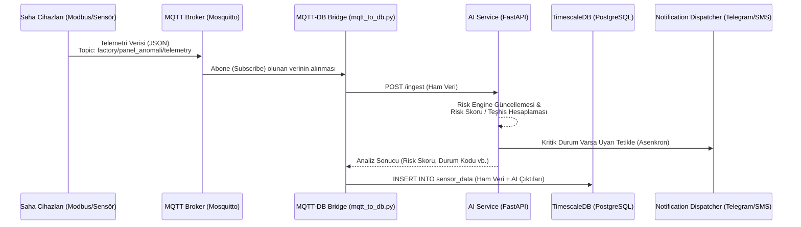

# Grid Up: Uçtan Uca Veri Akışı

Grid Up sistemi, sahadaki ham sensör verisini toplayıp işleyerek, veritabanına kaydedilmesi ve kritik durumlarda uyarı mekanizmalarının tetiklenmesine kadar giden kesintisiz (streaming) bir veri hattı sunar.

## Genel Akış Şeması

## Veri Akışı Adımları

1. **Veri Toplama (Ingestion):**
   Sahada bulunan sensörler, MPR-53CS ve TVOC-2 gibi cihazlar aracılığıyla toplanan akım, sıcaklık, nem ve ark durumu verilerini Modbus üzerinden okur ve JSON formatında MQTT Broker'a (`mosquitto`) iletir. Örnek Topic: `factory/panel_anomali/telemetry`.

2. **Mesaj Kuyruğu ve Köprüleme (Message Queue & Bridging):**
   Sistemde sürekli çalışan `mqtt_to_db.py` betiği (bridge/consumer), MQTT Broker'ı dinler. Yeni bir mesaj geldiğinde veriyi yakalar.

3. **Yapay Zeka Analizi (Inference via REST API):**
   `mqtt_to_db.py`, yakaladığı sensör payload'unu `main.py` içerisinde koşan ana FastAPI uygulamasının (AI Servisi) `/ingest` uç noktasına POST isteği ile yollar.
   * `engine.py` (RiskEngine), gelen veriyi buffer (tampon) sistemine ekler, zamansal geçmişle birleştirerek o anki **Risk Skoru**'nu, **Sağlık Durumu**'nu ve **Teşhis** çıktısını (Örn. SENSOR_FAULT, THERMAL_OVERLOAD) hesaplar.
   * API, analiz sonucunu geri döndürür.

4. **Veri Depolama (Persistence):**
   AI servisinden dönen sonuç (risk skoru, durum kodları) ve başlangıçtaki ham veri, `mqtt_to_db.py` tarafından zaman damgasıyla birlikte TimescaleDB (PostgreSQL) üzerindeki `sensor_data` tablosuna (INSERT işlemiyle) kaydedilir. Bu veriler gelecekteki model eğitimleri, SCADA ve Dashboard gösterimleri için kullanılır.

5. **Aksiyon ve Bildirim (Alerts & Notifications):**
   Eğer AI Servisi (FastAPI uç noktası), hesaplanan yeni risk düzeyinin WARNING veya CRITICAL düzeyinde olduğunu (ya da konfigürasyona bağlı olarak değiştiğini) tespit ederse, `communication/dispatcher.py` üzerinden arka planda uyarı mekanizmasını tetikler.
   * Tetiklenen uyarılar Telegram Botuna, SMS'e veya SCADA bloğuna ilgili teşhis ve önerilen aksiyonlar ile birlikte iletilir.

