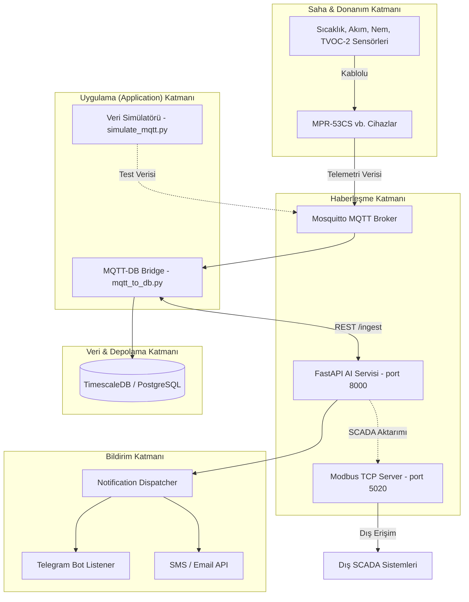

# Grid Up: Sistem Mimarisi

Grid Up Anomaly Detection projesi, tamamen "On-Premise" (bulut bağlantısı gerektirmeyen, şirket içi veya kapalı ağ) çalışabilecek şekilde tasarlanmış, modüler ve mikroservis yaklaşımından izler taşıyan bir sistem mimarisine sahiptir.

## Mimari Görünüm

## Temel Teknolojiler ve Bileşenler

### 1. Altyapı ve Veritabanı
*   **Docker & Docker-Compose:** Veritabanı (PostgreSQL) ve MQTT (Mosquitto) gibi yan servisler container (konteyner) içerisinde `docker-compose.yml` aracılığıyla izole olarak çalıştırılır.
*   **TimescaleDB (PostgreSQL):** Zaman serisi (time-series) sensör verilerini yüksek performansla kaydetmek ve geçmişe dönük anomali/trend analizleri yapabilmek için kullanılır.
*   **Mosquitto:** Hafif ve performanslı MQTT broker.

### 2. Çekirdek Uygulama (Backend & AI)
*   **Python 3.11+ & Poetry:** Sistem bağımlılık yönetimi `poetry` ile sağlanmaktadır. Bu sayede yeniden üretilebilir (reproducible) kurulumlar güvence altına alınır.
*   **FastAPI:** Yüksek performanslı ve asenkron REST API altyapısını sağlar. AI Risk Engine, doğrudan FastAPI içerisinden sarmalanarak (wrapped) hizmet verir.
*   **Scikit-Learn, Pandas, Numpy:** Veri manipülasyonu, özellik çıkarımı ve Isolation Forest (ML) algoritmalarının koşulması için kullanılan temel kütüphaneler. CPU üzerinde hızlı çalışacak şekilde optimize edilmiştir.

### 3. Protokoller ve Entegrasyon
*   **Modbus TCP:** SCADA entegrasyonu için. İç sistemdeki durum ve risk bilgileri, Modbus haritasına işlenerek dış izleme sistemlerine (SCADA) aktarılabilir.
*   **MQTT:** Sahadan gelen sürekli ve yüksek frekanslı sensör verilerini minimum gecikme ve asenkron mimari ile toplamak için.

### 4. Bildirimler (Notifications)
*   Merkezi bir *Dispatcher* (Yönlendirici) üzerinden çalışır. `src/grid_up_anomaly_detection/communication/` paketinde yer alır. İlgili arızanın kritikliğine göre (WATCH, WARNING, CRITICAL) ilgili kişilere Telegram, WhatsApp veya SMS gibi kanallardan anlık durum ve tavsiye (Action Recommendation) iletilir.

